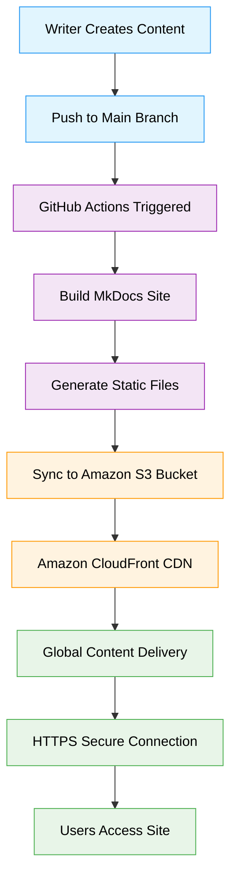

---
date:
  created: 2025-06-01
  updated: 2025-06-04
---

# Migrating from Docusaurus to MkDocs

Recently, I migrated my personal site from Docusaurus to MkDocs. This decision was driven by several factors, but a significant one was that Docusaurus is owned and maintained by Meta. While Docusaurus is a powerful and flexible documentation framework, I wanted to move to a platform that is more community-driven and open, aligning better with my values.

MkDocs, especially with the Material theme, offers a clean, fast, and highly customizable experience for static site generation. The migration process involved restructuring my documentation, updating configuration files, and moving content from MDX to standard Markdown. I also appreciated MkDocs' straightforward integration with Python tooling and its active, independent community.

If you're considering a similar move, the process is very manageable and the benefits—especially around transparency and community ownership—are well worth it.

## Learning curve

The learning curve for mkdocs is pretty shallow, especially with moving from docusaurus. Both build static sites off of markdown files, so the bulk of documentation doesn't need to change. There are some intricasies with updating the `mkdocs.yml` file that I need to dive in some more on, but I have zero complains for creating a basic site and publishing quickly.

## Deploying website

For deployment, I use **GitHub Actions** to automate the build and deployment process. Whenever I push changes to the main branch, a GitHub Actions workflow is triggered that builds the MkDocs site and syncs the generated static files to an Amazon S3 bucket. The site is then served through **Amazon CloudFront**, which provides a fast and secure CDN for global access.

This setup allows me to focus on writing content and making improvements, while the deployment and hosting are handled automatically in the background. Using S3 and CloudFront together ensures that the site is highly available, scalable, and benefits from low-latency delivery to visitors around the world.  

It's important to note that while you can host a static site directly from S3, that is limited to http connections. I'd prefer to let anyone who stumbles upon this site the comfort in knowing that it's using a secure connection.

