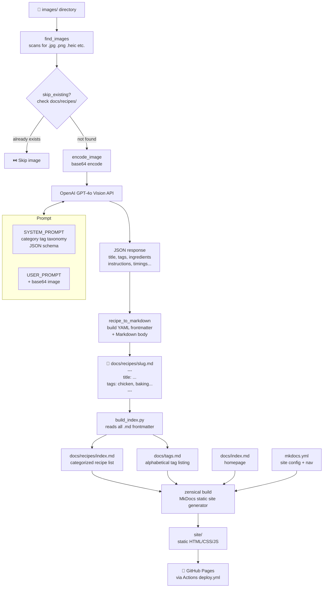

---
date:
  created: 2026-03-01
---

# Digitizing a Family Cookbook
[cookbook](https://scottsaenz.github.io/family_cookbook/)  
[source code](https://github.com/scottsaenz/family_cookbook)

I've been in posession of my grandma's cookbook for a few years with the intention of [digitizing the cookbook](https://scottsaenz.github.io/family_cookbook/). There are many recipes taken from magazines, back of packaging, and others where it's in a nice print that can easily be picked up from any OCR engine. The issue arises when reading in cursive recipes.
I have created an OCR engine previously when red-tape would have taken months for a python library to be approved. This was a tedious process that required using [open-cv](https://pypi.org/project/opencv-python/) and manually labeling each character that was scanned in order to train the model, and this was on printed text. Cursive text would be much harder because open cv relies on boundary boxes based on edges that do not exist as singular characters in cursive. This is where advancements in Model-as-a-service make it much easier (and less stressful).

## Workflow
After taking a picture for each recipe to be digitized and placing it in an images folder, we would send the image to OpenAI with a [prompt](https://github.com/scottsaenz/family_cookbook/blob/main/family_cookbook/process_recipes.py#L23) on what we're looking for. OpenAI would return the recipe and include any tags that will be used for searching on the site.
The response form OpenAI is converted into a markdown file, and after all recipes have been generated we would generate html files by using [Zensical](https://zensical.org/about/), creators of the Material theme for MkDocs.
The cookbook is pushed to Github pages, but any static site will do.

## Future Enhancements
I'd like others and myself to be able to add recipes to this easily, but haven't decided on the best path. Some things to consider is ease of use for others to add to the cookbook, adding it securely, avoid spamming of requests to add. Perhaps I can setup an email address w/ some rules around who sent the email and it must include specific wording in the subject. 